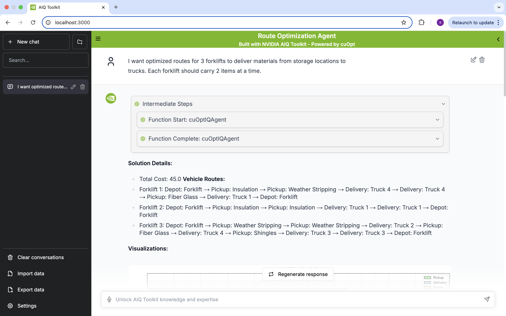

# cuOptIQ: Intelligent Route Optimization with NVIDIA Agent Intelligence Toolkit


https://developer.nvidia.com/agentiq-hackathon

## Overview

`cuOptIQ` is an intelligent agent system designed to optimize intra-factory logistics using NVIDIA's Agent Intelligence Toolkit and the cuOpt solver. It allows users to interact via natural language and generate optimized delivery routes in real time with visualizations.


## Features

- **Natural Language Interface**: Understand user requirements through conversational queries
- **Intelligent Data Processing**: Modify transport orders and fleet parameters based on user needs
- **High-Performance Optimization**: Leverage NVIDIA cuOpt for solving complex routing problems
- **Rich Visualizations**: Generate interactive charts and network graphs to visualize solutions
- **Modular Architecture**: Specialized agent functions that work together seamlessly

## Get Started

### Prerequisites

Before you begin using AIQ toolkit, ensure that you meet the following software prerequisites.

- Install [Git](https://git-scm.com/)
- Install [Git Large File Storage](https://git-lfs.github.com/) (LFS)
- Install [uv](https://docs.astral.sh/uv/getting-started/installation/)
- Install [Python (3.11 or 3.12)](https://www.python.org/downloads/)
## Installation

1. Clone this repository:
```bash
git clone https://github.com/SaiTarunChandrupatla/cuOptIQ.git
cd cuOptIQ
``` 

2. Set up the Python environment:
```bash
uv venv name
source /name/bin/activate # On Windows: venv\Scripts\activate
```

3. Install dependencies:
```bash
uv pip install agentiq
uv pip install matplotlib
``` 

4. Install the cuOptIQ agent:
```bash
cd cuOptIQAgent
uv pip install -e .
``` 

4. Set your API keys:
```bash
export OPENAI_API_KEY=your_openai_api_key
export CUOPT_API_KEY=your_nvidia_NIM_cuopt_api_key
```         
Get your NVIDIA NIM Cuopt API key from https://build.nvidia.com/

5. Start the agent:
```bash
aiq serve --config_file configs/config.yml --host 0.0.0.0 
``` 

6. Start the UI:
```bash
cd aiqtoolkit-opensource-ui
#(dependency installation)
npm ci 

npm run dev
``` 

7. Example Usage:
```bash
1) I want optimized routes for 3 forklifts to deliver materials from storage locations to trucks. Each forklift should carry 2 items at a time.

2) Please plan the most efficient routes for 2 forklifts to transport materials from storage zones to the trucks, with each forklift limited to carrying 3 items

3) Remove first two orders and optimize routes for 3 forklifts to deliver materials from storage locations to trucks. Each forklift should carry 2 items at a time.

4) Add two more orders same as the first two order in the data and give me the optimized routes for 4 forklifts to deliver materials from storage locations to trucks. Each forklift should carry 2 items at a time.
```





